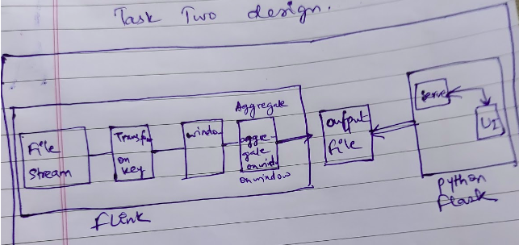
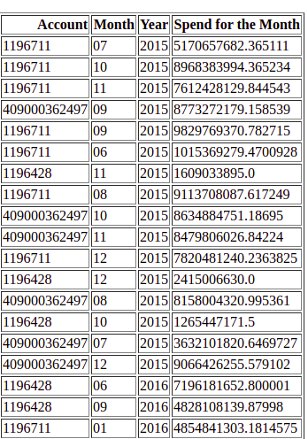

# flink_flask
A simple flink application that displays results on a flask webapp just for FUN!

## Thought Process:
Since I had no idea about Flink, I thought this is going to be a learning curve
I decided that I will first begin with the task 2, as I was not sure how much time its going to take for me to finish.





### Total time taken to solve: *~30hrs*

There were 3 parts to the problem
1. Flink based Streaming and Aggregation
2. Reporting Customers with more than 1B IDR spend (Created a Flask-webpage)
3. SQL Script to do the above task and comparison.

### Please follow the below steps:
These steps assume that
1. You have internet and superuser permissions.
2. No instances of flink are running.
3. You have pulled the code to your machine and are running all commands from the root folder of this repository.
4. docker and python3 is installed


### Step 1: (Time Taken ~28hrs)
Inputs and Processing:
It was a start from the scratch; All installations for Flink, Scala and Itelliij etc.
Since The majority of Flink's Functionalities are optimised in Scala/Java, I decided to learn Scala as well.
This is what took most of my time.
Out of that, most of my time got wasted on the basic step of importing packages for a scala
I know there is a python based implementation of Flink, but I was determined to do it the right way.

Once this was out of the way, and I had a basic understanding, I had a straight forward logic in my head:
1. Find a unique identifier for a month, and the account => Aggregate Over a sufficiently larger window;
Since this was an exercise based on a flat-file I did not want to deal with the out-of-order entries.
If it was a different scenario where we would want to give out real time alerts/reports we'd need to handle ooo entries as well.
2. Collect all the eligible entries on an output flat file to generate the report.

### Step 2: (Time Taken ~2hrs)
Outputs:
To display the report I choose to build a web page which tabulates the result generated from step 1.
It is a very simple python-flask based webapp which reads a flat-file and creates an HTML table 
Since it was not part of the original question, I have presented the bare-bones HTML webPage.

### Step 3: (Time Taken ~10mins)
SQL:
In my opinion, If we are doing such computations for a month or larger duration, It would be more efficient to process 
in a batch style or from a database. Having said that, if we are to do this in real time or for shorter time spans I think Flink is the best alternative. 
*Choosing right tool for the job.*
SQL for the above computation was pretty simple: 
We group by on the month, year and account number and get the aggregated sum; Which ever transactions are greater than the given number we select them.

*Query*
``` 
SELECT
  account_no, txn_month, txn_year, total_txns
FROM ( SELECT bd.account_no, 
  EXTRACT( MONTH FROM bd.date ) AS txn_month,
  EXTRACT( YEAR FROM bd.date ) AS txn_year,
  SUM(amount) AS total_txns
  FROM `static_sandbox.bank_data` bd
  GROUP BY 1, 2, 3
  ORDER BY
    3 DESC )
WHERE
  total_txns > 1000000000
```
This is a query I wrote for Bigquery; same can be used for SQL with slight modification.
The result also checks out from both the steps as we get 107 account-month combination; also the spend matches
for both the cases.

## How To:
### Build Image
The docker build is based out on two prebuilt images; It takes a little while to download
run ``` sudo docker build -t flink_task2 . -f Dockerfile-flink --force-rm ```
### Start the Application
Once the build is successful, run
``` <docker compose up>```
from the same folder
### Check Results
Now that your job has been executed.
You can simply check the final_outputs.txt as requested, but to check the data in neatly formatted way.. please run the following

```pip install -r requirements.txt ```

``` python3 flask_app/main.py ```

And now, You can head over to [This link](https://localhost:8083).
You'll be able to see the resultant table

## Output:


## Potential Improvements
If we want to make this system production ready:

1. Refactoring the code a little.
2. Handling the out-of-order events.
3. Adding proper sink for result storage.
4. Making it configuration based so that the same application can be reused for a variety of tasks.

## References:
I went through a lot of websites, these are the best ones that I liked and were helpful
- https://ci.apache.org/projects/flink/flink-docs-stable/dev/datastream_api.html
- https://ci.apache.org/projects/flink/flink-docs-release-1.2/dev/batch/index.html
- https://ci.apache.org/projects/flink/flink-docs-stable/dev/scala_api_extensions.html
- https://mvnrepository.com/artifact/org.apache.flink/flink-streaming-scala_2.11/1.12.2 (Incomplete reference)
- https://databricks.com/blog/2016/12/12/apache-spark-scala-library-development-with-databricks.html (The one that worked!)
- https://engineering.zalando.com/posts/2016/03/apache-showdown-flink-vs.-spark.html
- https://ci.apache.org/projects/flink/flink-docs-stable/dev/stream/operators/
